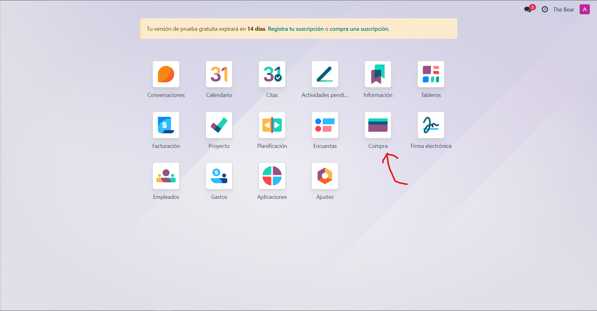
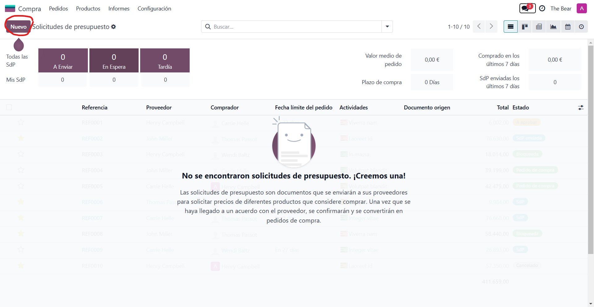

# SGE_A_GRUPE
-------------

## Integrants del grup
Som el grup E, format per:
..* A: Daniel Baquedano
..* B: Adria Mele
..* C: Marc Bertran
..* D: Josselin De la cruz

## Divisio de tasques:
La repartició de les tasques sera de la seguent forma:
..*Empleats (A)
..*Vendes (B)
..*Compres (C)
..*Punts de venda (D)
..*Events (A)
..*Calendari (B)
..*Costos (C)
..*Planificació (D)

### Compres(C)
Entrem al apartat de compres del nostre odoo:

Veurem la següent pagina on crearem un nou presupost.
