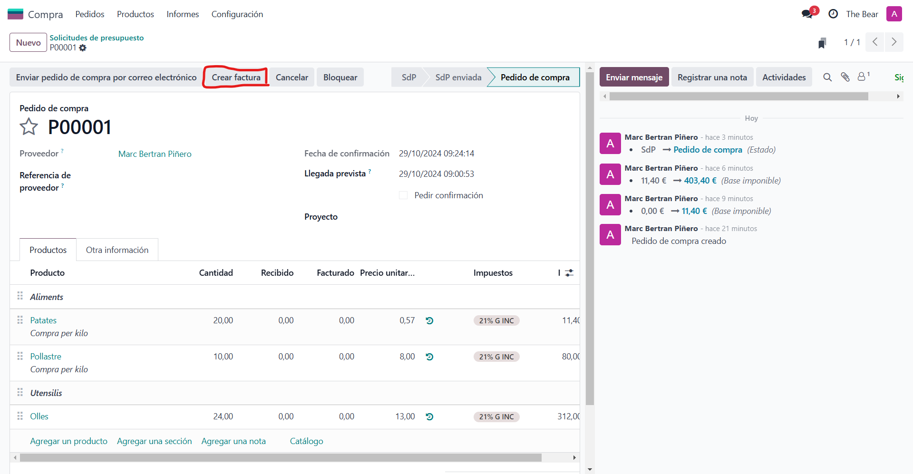

# SGE_A_GRUPE
-------------
## Integrants del grup
Som el grup E, format per:
>* A: Daniel Baquedano
>* B: Adria Mele
>* C: Marc Bertran
>* D: Josselin De la cruz

## Divisio de tasques:
La repartició de les tasques sera de la seguent forma:
>* Empleats (A)
>* Vendes (B)
>* Compres (C)
>* Punts de venda (D)
>* Events (A)
>* Calendari (B)
>* Costos (C)
>* Planificació (D)

### Compres(C)
----
Entrem al apartat de compres del nostre odoo:

Veurem la següent pagina on crearem un nou presupost.

Cal completar, com a minim, els camps marcats en vermell:

Un cop creat el presupost podem afegir els items que volem/nececitem comprar com pre exemple:

Fent servir els botons "Agregar producto" i "Agregar sección" oh podrem tenir mes ordenat.

Un cop tenim tot el que volem comprar apuntat comfirmem la comanda amb el boto "Confirmar pedido".

Un cop comprat es crea la factura desde el boto "Crear factura"
