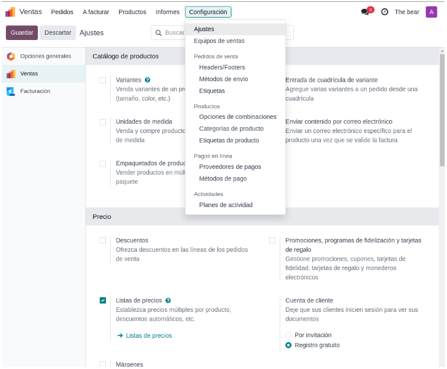
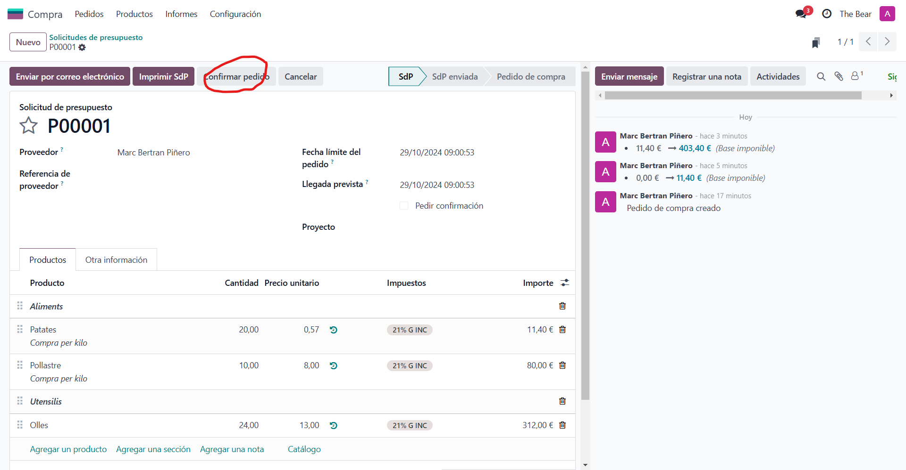
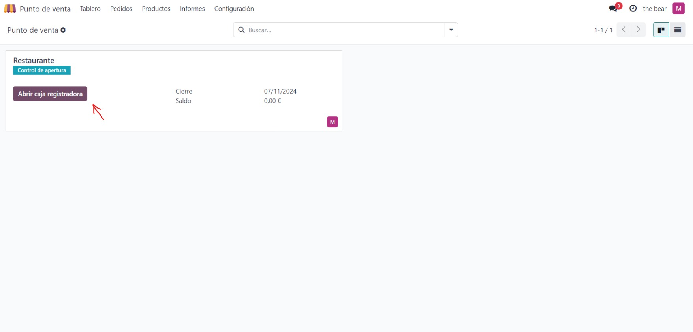
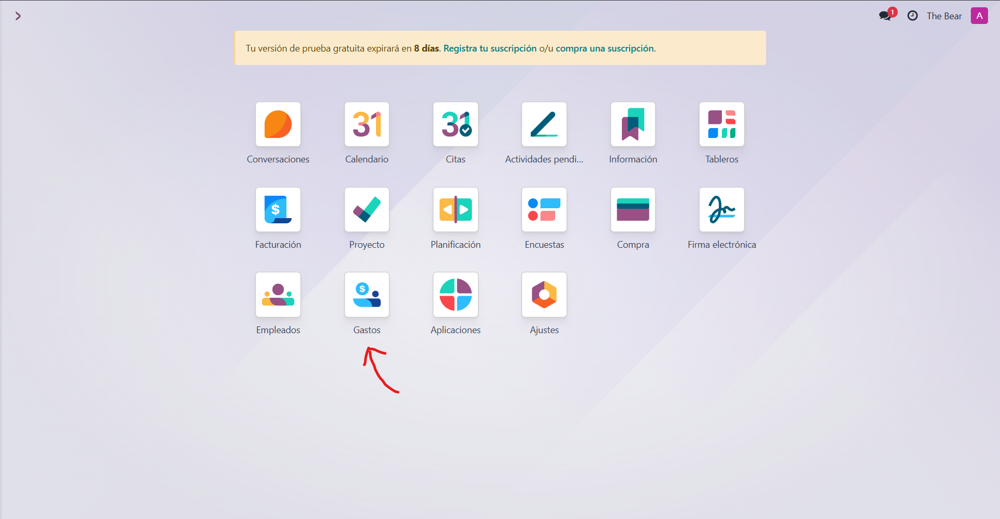

# SGE_A_GRUPE

## Integrants del grup
Som el grup E, format per:
>* A: Daniel Baquedano
>* B: Adria Mele
>* C: Marc Bertran
>* D: Josselin De la cruz

## Divisió de tasques:

La repartició de les tasques serà de la següent forma:

>* Empleats (A)
>* Vendes (B)
>* Compres (C)
>* Punts de venda (D)
>* Events (A)
>* Calendari (B)
>* Costos (C)
>* Planificació (D)

----
### Empleats(A)
----

Per començar, hem d'instal·lar el mòdul d'Empleats, que seria el següent:

Un cop instal·lada, podem clicar a "Crear" i allà en sortirà la següent pestanya en la qual podem omplir amb les dades dels treballadors.

Un cop creats ens sortirien cada cop que entrem a empleats d'aquesta manera:

També podem crear "Departaments" on posar a cada empleat:

Un exemple d'un parell de departaments seria com aquests:

----
### Vendes(B)
----
Per començar, com es pot veure en el menú, als mòduls instal·lats hi haurà un mòdul de vendes.

Dins d’aquest mòdul, es poden veure i crear pressupostos i comandes a gust indicant el client, el producte venut i afegint si cal un servei d’entrega a domicili. També es podrá cancelar o fer una factura d’aquest i es veurà l’estat de cada comanda / pressupost.

A la pàgina “Pedidos” es poden veure les comandes i el seu estat a més de poder crear una nova.

Per exemple, si el client habitual Manel Garcia demana un Menú del día, es pot afegir com a comanda fàcilment.

A la pàgina “Equipos de ventas” es veuran estadístiques i gràfiques que ajudaran a veure quines comandes són realitzades més sovint, per quins clients, etc…

A la pàgina de clients, es poden visualitzar i crear clients habituals en forma d’individu o empreses. Aquests clients també es poden crear a l’hora de fer una nova comanda o pressupost.

També hi ha una pàgina de productes on es poden afegir productes amb el seu preu per utilitzar-los en comandes més endavant.

Les comandes i pressupostos es poden facturar i a la pàgina “Pedidos a facturar” es veuen totes aquestes factures que encara no s’han pagat.

Ja acabant, hi ha una secció d’informes on es poden veure més gràfics i informes de les vendes, comercials, productes i clients per ajudar amb el màrqueting de l’empresa.

Finalment, es pot canviar la configuració de la pàgina per tindre-la al gust i mostrant únicament el que interesa.

----
### Compres(C)
----

Entrem a l'apartat de compres del nostre odoo:

Veurem la següent pàgina on crearem un nou pressupost.

Cal completar, com a mínim, els camps marcats en vermell:

Un cop creat el pressupost podem afegir els ítems que volem/necessitem comprar com per exemple:

Fent servir els botons "Agregar producto" i "Agregar sección" oh podrem tenir més ordenat.

Un cop tenim tot el que volem comprar apuntat confirmem la comanda amb el botó "Confirmar pedido".

Amb els botons de la dreta "Enviar mensaje", "Registrar nota" i "Actividades" es pot anar comentant i organitzant el procés de compra.

>En activitats cal tenir en compte les següents coses:
>     
>>Quina activitat és:   
>>    
>>El dia que s'ha d'acabar.     
>>Un resum de l'activitat.

Un cop acabades les activitats es crea la factura des del botó "Crear factura".

Després de comprovar la factura per últim cop la podrem aprovar. S'han d'omplir tots els camps.

I finalment es paga la factura.

>Per pagar, primer s'ha de crear el pagament.
>

Un cop pagada es veurà d'aquesta forma.

Des d'aquesta última pàgina es pot rectificar la factura o tornar-la a un esborrany.

Des del menú de dalt a l'esquerra podràs navegar entre els teus pressupostos, productes i sol·licituds de compra que hagis creat. A més a més, en "Informes" podràs veure gràfics de les teves gestions de compres.

----
### Punt de venta(D)
----

Primer hem d'accedir a 'Punt de venda'

Abans de començar, s'ha de revisar la caixa registradora i tenir un control dels diners que conté

És necessari tenir diferents de bitllets, per a això hem de triar el tipus de bitllet

Revisem que tot estigui bé, i podem obrir la caixa registradora

Seleccionem el número de taula, per a començar a comandar

En aquesta opció podem triar el menjar i beguda, així tindríem un ordre adequat del que demana cada taula. Es pot agregar la quantitat que desitgis de cada cosa.

En finalitzar, en realitzar el pagament, ens dona l'opció de pagament en efectiu o amb targeta.

En aquest cas, triem l'opció 'targeta', client i en cas desitgi una factura.

Després valguts la informació ingressada.

Una vegada realitzat el pagament, el POST emet una factura.

----
### Calendari(B)
----

Al menú principal, s’ha afegit el mòdul de calendari.

El calendari es pot organitzar per dia, setmana, mes o any. A continuació es pot veure el calendari del mes de novembre amb les reunions creades amb diferents duracions i horaris.

També hi ha l’opció de crear assistent per sel·leccionar-los a diferents reunions i cites.

Al crear una reunió, s’introdueix una data amb un horari i la seva duració a més de moltes altres funcions addicionals com l’ubicació, una URL en cas de que sigui una Videoconferència, la teva privacitat durant aquest event, una descripció i els assistents.

Finalment, hi ha la pàgina de configuració on es pot personalitzar el calendari per sincronitzar-lo amb el Calendari de Outlook o de Google.

----
### Costos(C)
----

Benvingut a l'apartat de Costos de odoo! Per gestionar-lo primer hem d'entrar fent clic a la icona de "Gastos":

Un cop dins veure'm aquesta pàgina.

Afegim un rebut d'alguna compra. Per fer-ho fem clic al botó "Nuevo", o "Subir" si el tenim en digital.

Un cop creat s'ha d'afegir la informació del rebut. No t'oblidis de completar-ho tot. Com més informació hi entris, més fàcil serà comprendre de què és el rebut en un futur.

> Molt important! Si la companyia és la que ha pagat el rebut, apareixerà la casella de "Proveedor". 
>

Un cop creat el rebut, creem l'informe.

Ara haurem d'omplir la informació del Gerent i amb quin mètode de pagament farem servir. I l'enviem al gerent amb el botó "Enviar al gerente".

Ara ens apareixerà el botó per: Aprovar o Denegar el rebut.

Aprobem el rebut.

Per pagar el rebut, fem clic al botó "Registrar asientos contables"

Un cop pagat es veurà d'aquesta manera.

Des d'aquesta mateixa pàgina es pot tornar el rebut com a esborrany.

Quan hi haguin diversos rebuts i informes, segurament es voldrà veure un historial, o fer gràfics. Amb la pestanya d'"Informes" es crearan gràfics automàticament amb tota la informació que es necessiti.

----
### Planificació(D)
----

Amb aquesta opció podem planificar o tenir un control de les persones que treballen en l'empresa, tenir organitzat els horaris de treball o agendar una cosa important.

