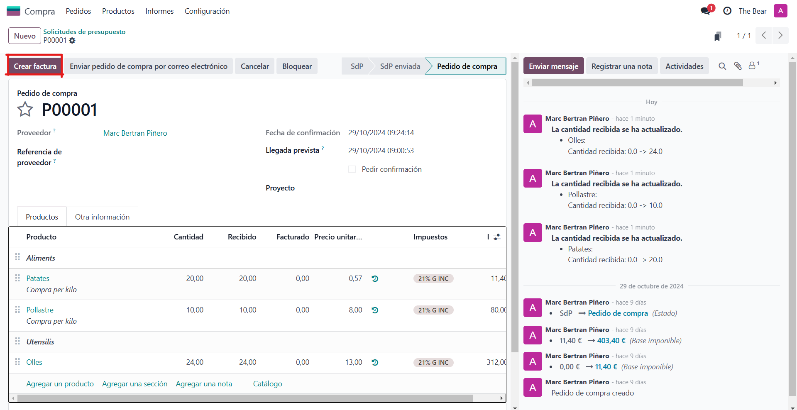

# SGE_A_GRUPE
-------------
## Integrants del grup
Som el grup E, format per:
>* A: Daniel Baquedano
>* B: Adria Mele
>* C: Marc Bertran
>* D: Josselin De la cruz

## Divisio de tasques:
La repartició de les tasques sera de la seguent forma:
>* Empleats (A)
>* Vendes (B)
>* Compres (C)
>* Punts de venda (D)
>* Events (A)
>* Calendari (B)
>* Costos (C)
>* Planificació (D)

### Empleats(A)
----
Per començar hem de instalar el modul d'Empleats, que seria el seguent:

Un cop instalada, podem clicar a "Crear" i alla en sortira la seguent pestanya en la que podem omplir amb les dades del treballadors.

Un cop creats ens sortirien cada cop que entrem a empleats d'aquesta manera:

Tambe podem crear "Departaments" on posar a cada empleat:

Un exemple de un parell de departaments seria com aquets:

### Compres(C)
----
Entrem al apartat de compres del nostre odoo:

Veurem la següent pagina on crearem un nou presupost.

Cal completar, com a minim, els camps marcats en vermell:

Un cop creat el presupost podem afegir els items que volem/nececitem comprar com pre exemple:

Fent servir els botons "Agregar producto" i "Agregar sección" oh podrem tenir mes ordenat.

Un cop tenim tot el que volem comprar apuntat comfirmem la comanda amb el boto "Confirmar pedido".

Amb els botons de la dreta "Enviar mensaje", "Registrar nota" i "Actividades" es pot anar comentant i organitzant el proces de compra.

>En activitats cal tenir en compte les seguents coses:
>     
>>Quina activitat es:   
>>    
>>El dia que s'ha d'acabar.     
>>Un resum de l'activitat.

Un cop acabades les activitats es crea la factura desde el boto "Crear factura".

Despres de comprovar la factura per ultim cop la podrem aprobar. S'han d'omplir tots els camps.

I finalment pagem la factura.

>Per pagar, primer s'ha de crear el pagament.
>

Un cop pagada es veura d'aquesta forma.

Desde aquesta ultima pagina es pot rectificar la factura o tornar-la a un borrador.

Desde el menu d'adalt a la esquerra podras navegar entre els teus presupostos, productes i solicituts de compra que haguis creat. A mes a mes, en "Informes" podras veure grafics de les teves gestions de compres.

### Costos(C)
----
Benvingut al apartat de Costos de odoo! Per gestionar-l'ho primer hem d'entrar fent clic a la icona de "Gastos":

Un cop dins veurem aquesta pagina.

Anem a afegir un rebut d'alguna compra. Per fero fem clic al boto "Nuevo", o "Subir" si el tenim en digital.

Un cop creat s'ha d'afegir la informació del rebut. No t'oblidis de completar-ho tot. Com mes informació hi entris, mes facil serà comprendre de que es el rebut en un futur.

> Molt important! Si la compañia es la que ha pagat el rebut, apareixera la casella de "Proveedor". 
>

Un cop creat el rebut, creem l'informe.

Ara haurem d'omplir la informació del Gerent i amb quin metode de pagament farem servir. I l'enviem al gerent amb el boto "Enviar al gerente".

Ara ens apareixera el boto per: Aprobar o Denegar el rebut.

Aprobem el rebut.

Per pagar el rebut, fem clic al boto "Registrar asientos contables"

Un cop pagat es veura d'aquesta manera.

Desde aquesta mateixa pagina es pot tornar e rebut com a borrador.

Quan hi haguin varios rebuts i informes, segurament es voldra veure un historial, o fer grafics. Amb la pestanya de "Informes" es crearan grafics automaticament amb tota la informació que es necessiti.
